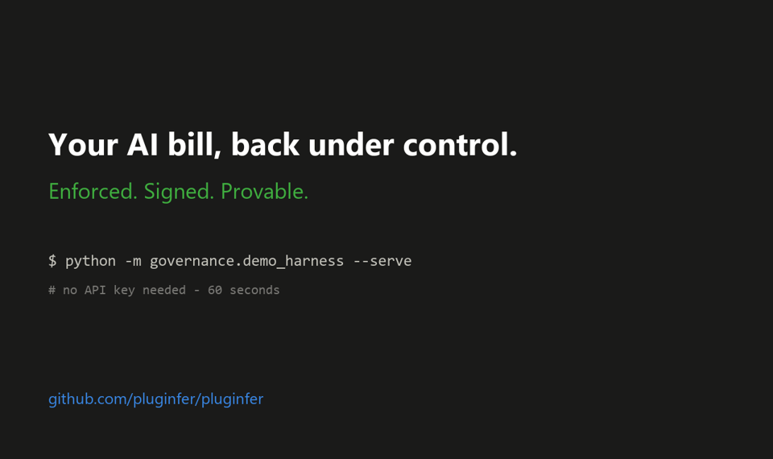

# Pluginfer

> **Your AI bill, back under control — enforced, attributed, and provable.**
> A fail-closed spend gateway for OpenAI/Anthropic-compatible APIs that
> makes budget overruns *impossible* instead of merely visible, cuts the
> bill with measured (never projected) savings, and signs every call
> into a tamper-evident audit chain. Fully on-premises, one base-URL
> change, zero mesh required. The decentralized compute mesh it can
> route into is the second act — and we're honest about its status.

[](LICENSE)
[](https://www.python.org/)
[](AUDIT.md)



## The problem

73% of enterprises overrun their AI budgets. Token spend broke the
management model: it isn't rate-limited, isn't attributable, and isn't
forecastable — and your AI vendor can't fix that, because their revenue
*is* your token growth. Every existing tool observes spend after the
fact. This one refuses the call **before** the money leaves.

## See it in 60 seconds (no API key needed)

```sh
git clone https://github.com/pluginfer/pluginfer && cd pluginfer/v2
pip install fastapi uvicorn httpx
python -m governance.demo_harness --serve
# open http://127.0.0.1:8799/dashboard
```

The demo drives a realistic traffic mix through the real gateway
against a simulated upstream: watch envelopes fill, a team hit its cap
and get refused with HTTP 402, cache hits land at $0, and the signed
receipt chain verify itself. Then hit `/demo/tamper` and watch the
audit badge catch the edit.

## Signet — the AI spend gateway that signs its receipts

Point your apps at the gateway instead of `api.openai.com` /
`api.anthropic.com` — one base-URL change; every OpenAI-compatible SDK
already supports it. Your provider key stays server-side.

- **Fail-closed budget envelopes** — hierarchical caps
  (`acme/support/chatbot`) reserved *before* the upstream call.
  Exhausted envelope → HTTP 402 with a machine-readable reason. An
  overrun is structurally impossible, not a dashboard alert.
- **Governed streaming** — hold taken up-front, live SSE relay, hard
  mid-stream cutoff the moment the running cost reaches the hold.
- **Measured savings, never projections** — exact-match + semantic
  response cache (a hit costs $0 and the receipt records what the
  upstream *actually billed* last time), opt-in cheap-model cascade
  with a conservative scorer, opt-in prompt compression. Escalation
  overhead is shown in red, subtracted from net — never hidden.
- **One gateway, many LLMs — automatic model selection.** Plug in any
  number of models (one is fine too) and let the router do the picking
  that used to be a manual, per-request judgment call:
  `PLUGINFER_GW_AUTOROUTE=save` sends easy prompts (chat/summarize/
  extract) to your cheapest model and leaves hard ones alone; `=smart`
  also upgrades hard prompts (code/long-context) to your most capable
  model; or write full custom rules (`PLUGINFER_GW_ROUTES`) mapping any
  envelope / prompt pattern / task / size to any model. **Any number of
  models**, and they can live on **different providers** — give a
  price-sheet entry its own `upstream` and `api_key_env` and that
  model's calls leave for its own provider with its own key, all from a
  single endpoint. Works with any LLM reachable over an
  **OpenAI-compatible chat API** — nearly the whole market (OpenAI,
  Groq, Mistral, Together, DeepSeek, OpenRouter, local Ollama/vLLM, and
  the OpenAI-compatible endpoints Anthropic and Google publish). A
  provider you call through its *native* non-OpenAI format needs a
  small adapter — we don't pretend otherwise. The classifier is
  transparent keyword heuristics, not a hidden model, so every route is
  explainable on the receipt; upgrades that cost more are recorded as a
  **negative** saving, never disguised as a win.
- **Signed, hash-chained receipts** — Ed25519 by default; each receipt
  embeds the previous one's hash and survives restarts. Any edit to
  history is caught at the exact receipt, verifiable by a third party
  with the public key alone (`/v1/receipts/verify`, `/v1/audit/anchor`
  for external anchoring). We deliberately do **not** call this a
  blockchain — one gateway is one writer.
- **Attribution** — spend by envelope, by model, and by API-key
  fingerprint (raw keys never stored). "The $455M went *where*?"
  becomes a query.
- **Auth that fails closed** — client keys (pinnable to an envelope),
  read keys, admin keys; startup refuses to bind a public interface
  with no auth configured.
- **A dashboard humans can read** — Plain-English, Technical, and
  Logs-&-audit views. Self-contained HTML, airgap-safe, light + dark.

The `governance/` package is deliberately standalone: pure
stdlib + FastAPI, no torch, no mesh — verified at ~600 ms / ~400
modules to import. Deploy it on your premises; nothing leaves your
network except your own upstream calls.

## The mesh (second act — read [AUDIT.md](AUDIT.md) first)

The longer bet: a sealed-bid compute marketplace where peer GPUs and
private datacenters bid against centralized APIs, with quorum
verification (K-of-N agreement across independent nodes) as the
honest mitigation for untrusted compute. We publish
[AUDIT.md](AUDIT.md) so nobody has to take our word for which claims
are proven, mitigated, or open.

**Mesh at a glance:**

- **One command to join** — `pluginfer up` runs a node; add `--share`
  and a free auto-tunnel makes it reachable worldwide with no router
  config. Self-supervising: it never stays down.
- **Sealed-bid auction routing** — each job goes to the cheapest node
  that still meets your cost, latency, quality, and privacy limits;
  your own machine wins when it's the best fit, so work only leaves
  home when a peer is genuinely better.
- **Quorum verification (K-of-N)** — run the same job on K independent
  nodes (default 3) and majority-vote the result, so one lying node
  can't corrupt the answer. The honest fix for untrusted compute.
- **Free to try, no token, ever** — `POST /v1/testnet/faucet` grants a
  one-time starter balance; the ledger is plain USD, not a coin. No
  emissions, no presale, no "buy in to participate."
- **A money ledger that audits itself** — every balance must equal its
  signed entry history (`GET /v1/ledger/verify`, public); tampering or
  deletion is detected and blocks payouts automatically.
- **Signed receipts end to end** — every job and every settlement is
  Ed25519-signed and independently verifiable, on both the gateway and
  the mesh.

**Two-strangers WAN run: cleared.** A GitHub-hosted runner (a machine
on Microsoft's network) submitted a job to a node behind a home router
NAT, over the open internet, with no shared network and no seed — the
home node executed and signed it. It's a public, re-runnable proof:
see the [`wan-proof`
workflow](.github/workflows/wan-proof.yml) and its Actions logs. The
still-open milestone is two *independent home networks* introduced by a
public seed (needs a hosted seed VM) — tracked honestly, not claimed.

Run a node:

```sh
cd v2 && pip install -r requirements.txt
python pluginfer.py up            # your own gateway, local
python pluginfer.py up --share    # + let the mesh reach you (auto-tunnel)
```

`up` detects your hardware, binds local models (real ones via
[Ollama](https://ollama.com) if present; an honestly-tagged echo
otherwise), self-supervises, and points any OpenAI client at
`http://127.0.0.1:8100/v1`. `--share` opens a free
[Cloudflare](https://developers.cloudflare.com/cloudflare-one/connections/connect-networks/do-more-with-tunnels/trycloudflare/)
tunnel (no account, no card) so other nodes can send you jobs with zero
router config — the one manual step of running a public node, made
automatic. `--seed-host <ip>` joins a specific mesh.

### Testnet economics — stated up-front

The mesh currently runs **testnet economics**, and every money endpoint
says so in its response. What that means, so it can never be quietly
walked back:

- Earnings and commissions accrue as **real, persistent, auditable
  accounting** (`/v1/ledger/wallets/{id}`, `/v1/ledger/treasury`) — but
  they are **not redeemable for cash** during testnet.
- Testnet balances are **preserved**. Whether and how they are
  recognized at mainnet will be announced *before* mainnet opens —
  never decided retroactively.
- Real deposits and payouts are **disabled at the endpoint level**
  during testnet (a mis-set payment key cannot charge anyone). The
  cash rails (exactly-once deposits, two-phase withdrawals) are built
  and tested in `core/payment_flows.py`; flipping to mainnet is an
  explicit operator act requiring a real payment gateway.
- Payouts will only ever come from **real buyer payments** — provider
  earnings are never subsidized from a treasury and there are no token
  emissions.
- **The money ledger audits itself — strictly, starting on testnet.**
  Every balance must equal its full entry history: `GET
  /v1/ledger/verify` recomputes it on demand (public), the state file
  is hash-sealed, and a deleted state file is detected, not forgotten.
  Any integrity doubt blocks withdrawals automatically. Honest scope:
  a host can always edit files on their own machine — that's physics —
  which is why tampering is *detected* locally and payouts are only
  ever decided from the operator's authoritative ledger, never from a
  host-submitted file.
- **Trying the mesh is free during testnet.** There is nothing to buy:
  `POST /v1/testnet/faucet {"wallet_id": "you"}` grants a one-time
  starter balance (default $25 test-USD, once per wallet) so anyone
  can run real jobs through the real auction/escrow/commission
  machinery at zero cost. The faucet refuses outright in mainnet mode.
- **There is no token — at mainnet either.** The ledger is denominated
  in plain USD. When mainnet opens, buyers deposit real money through
  a payment processor and providers withdraw real money; onboarding is
  as exotic as topping up a cloud account. The bootstrap sequence is
  deliberately usage-first: prove the loop on testnet → free real
  demand via faucet credits → priced demand from Signet receipts →
  fiat deposits open last, when there's something real to pay for.

## Honesty policy

Every money- or trust-claim in this repo is either tested, labelled an
estimate, or listed as open in [AUDIT.md](AUDIT.md). Savings are
reported only as measured counterfactuals from receipts. If you catch
us over-claiming, open an issue — that's a bug with the same severity
as a crash.

## Contributing

Bug reports, security advisories, PRs welcome — see
[docs/SECURITY.md](docs/SECURITY.md#responsible-disclosure). Run the
suite before a PR:

```sh
cd v2 && python -m pytest tests/ -q
```

## License

Apache 2.0. See [LICENSE](LICENSE).
